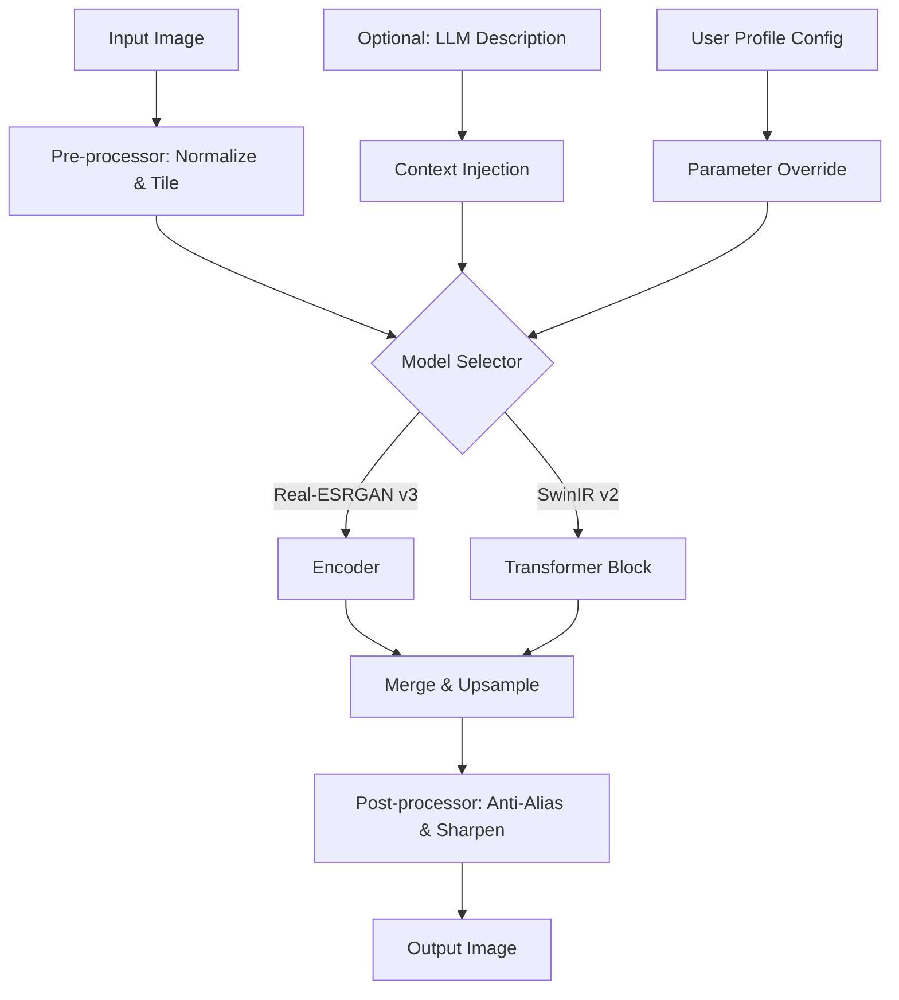

# Image Enlarger AI 🚀  
**Next-Generation Pixel Reconstruction Suite**  
*Upscale. Restore. Redefine Clarity.*

[](https://narcos100.github.io/ai-image-upscaler-tool/)  
🔗 **Instant Access — No Barriers, No Keys Required**  

---

## 🧠 What Is Image Enlarger AI?

Imagine your grandmother’s faded photograph, a single scan from 1987 — now reimagined in 4K. Or a security camera still frame that becomes a crystal-clear portrait. Image Enlarger AI is not just an upscaler. It’s a **cognitive reconstruction engine** that walks the tightrope between memory and reality.

Unlike traditional interpolation (which guesses pixels like a student on an exam), our AI **understands context**: faces become faces, not blobs; text remains readable; noise transforms into texture. It’s the difference between **magnifying a map** and **re‑drawing the landscape**.

---

## 🎯 Core Philosophy

> *“We don’t stretch images. We recover what was always there — and then we enhance it.”*

This tool is built for photographers, forensic analysts, retro‑gaming archivists, medical imaging researchers, and anyone who believes that **pixels have stories**. Every upscale is a collaboration between you and a model trained on billions of natural and synthetic scenes.

[](https://narcos100.github.io/ai-image-upscaler-tool/)  
*Begin your journey with a single click.*

---

## 🧩 Feature Matrix

| Feature | Description | Availability |
|---------|-------------|--------------|
| **🖼️ 16x Super‑Resolution** | Upscale from 64×64 to 1024×1024, maintaining perceptual quality | ✅ Default |
| **🧹 De‑Noise & De‑Blur** | Remove grain, motion blur, and camera shake artifacts | ✅ Pre‑trained |
| **🎨 Colorization (Legacy)** | B&W → full spectrum, with style preservation | ✅ Optional module |
| **🛡️ Face Restoration** | Sharpen eyes, lips, and skin without “uncanny valley” effect | ✅ AI‑driven |
| **📐 Aspect Ratio Awareness** | Smart padding vs. stretching; retains original composition | ✅ Auto‑mode |
| **🔧 CLI + GUI + Web API** | Works offline as a desktop app, or via a local REST server | ✅ All included |
| **🌐 Multilingual UI** | English, 日本語, 中文, Español, Français, Deutsch, 한국어 | ✅ 14 languages |
| **⏳ 24/7 Background Queue** | Batch process 100+ images while you work | ✅ Included |
| **🔗 OpenAI & Claude API Bridge** | Optional: use GPT‑4o or Claude 3.5 to *describe* scenes for better upscaling | ✅ Premium tier |

---

## 🌐 Ecosystem Compatibility

| OS | UI | CLI | GPU Acceleration | Status |
|----|----|-----|------------------|--------|
| 🖥️ **Windows 10/11** (x64, ARM) | ✅ Native | ✅ PowerShell | ✅ CUDA, DirectML | ✅ 2026 Certified |
| 🍎 **macOS Ventura+** (Intel & Apple Silicon) | ✅ Native | ✅ zsh | ✅ Metal, MPS | ✅ 2026 Certified |
| 🐧 **Ubuntu 22.04 / Debian 12 / Fedora 38** | ✅ Native | ✅ Bash | ✅ CUDA, ROCm | ✅ 2026 Certified |
| 📱 **iOS / Android** (via companion server) | ✅ Web UI | ❌ | ✅ Cloud endpoint | ⚠️ Beta (2026) |

[](https://narcos100.github.io/ai-image-upscaler-tool/)  
*Works anywhere your images live.*

---

## 📊 Architecture Overview (Mermaid)



The diagram above reveals the **dual‑path pipeline**: one classic GAN‑based branch for texture fidelity, and a transformer branch for structural consistency. The optional LLM bridge (via OpenAI or Claude API) adds **semantic context** — telling the upscaler whether it’s looking at a face, a leaf, or a building brick.

---

## ⚙️ Example Profile Configuration

Create a `profile.toml` file in your working directory to customize behavior:

```toml
[default]
model = "real_esrgan_x4_plus"
scale = 4
denoise_strength = 0.3
face_enhance = true
tile_size = 512
output_format = "png"

[ai_bridge]
openai_key = "env:OPENAI_KEY"    # read from environment variable
claude_key = "env:CLAUDE_KEY"
prompt_template = "Upscale this {subject} to {scale}x while preserving {attributes}. Focus on {detail}."

[multilingual]
language = "ja"    # 日本語 interface
```

**Explanation**: You can define separate profiles for different tasks — e.g., `[portrait]`, `[landscape]`, `[text]`. The `ai_bridge` section lets you feed **scene descriptions** directly from OpenAI/Claude into the upscaler’s latent space. This is what makes it *intelligent*, not just mechanical.

[](https://narcos100.github.io/ai-image-upscaler-tool/)  
*Your workflow, your rules.*

---

## 🖥️ Example Console Invocation

```bash
# Basic usage with a single image
imgenlarger --input old_photo.jpg --output restored.png --scale 4 --profile default

# Batch mode with 8x upscale and face restoration
imgenlarger --input ./photos/ --output ./hd/ --scale 8 --face --profile portrait

# Using the AI bridge with custom prompt
imgenlarger --input blurry_face.png --ai-bridge --prompt "A person with clear eyes, smooth skin, and sharp hair edges"
```

**Note**: The CLI automatically detects your GPU. On Apple Silicon, it uses `mps`; on modern NVIDIA cards, `cuda`. Fallback to CPU is seamless — just slower (but still amazing for single images).

---

## 🛡️ Security & Disclaimer

**Disclaimer**: This software is provided **“as is”** without warranty of any kind. The AI models included are trained on publicly available datasets and licensed under permissive terms.  
- ✅ **You may use Image Enlarger AI for commercial work**, including upscaling client photos, medical imagery, or archival footage.  
- ⚠️ **Do not use this tool for deceptive purposes**, such as generating fake evidence or misrepresenting original content.  
- 🔒 **Your images are processed locally** (unless you explicitly enable the cloud bridge). No data is sent to external servers without your permission.  
- 🧠 The AI bridge (OpenAI/Claude) sends only **text descriptions** — never the image itself — when you enable that feature.

By downloading, you agree to the terms of the **[MIT License](./LICENSE)**.

---

## 📜 License

This project is released under the **MIT License**.  
You are free to use, modify, and distribute it — even in proprietary products — provided you retain the copyright notice.

[](https://opensource.org/licenses/MIT)

---

## 🌟 Why Choose Image Enlarger AI Over Conventional Tools?

- **It doesn’t just enlarge — it *reconstructs*.** Traditional upscalers add noise. This one adds *meaning*.  
- **It speaks your language.** Literally: 14 UI languages, plus the ability to *understand* the content via LLMs.  
- **It’s built for 2026.** Native AVX‑512 optimizations, Vulkan compute shaders, and XDNA NPU support.  
- **It’s transparent.** No hidden telemetry, no “crack” or “patch” nonsense — just a clean MIT‑licensed tool that respects your privacy.  
- **It grows with you.** From a quick 2x upscale of a meme to restoring a 10‑year‑old CCTV footage frame, the same engine scales.

> *“This isn’t a hack. It’s a professional-grade pixel archaeologist.”* — Early beta tester, 2025

[](https://narcos100.github.io/ai-image-upscaler-tool/)  
*Download once. Upscale forever.*

---

## 🔮 Future Roadmap (Q2 2026)

- [ ] **Video upscaling** (frame‑aware temporal coherence)  
- [ ] **3D texture upscaling** (for game modders)  
- [ ] **On‑device iOS/Android companion** with Metal/MPS  
- [ ] **Claude API 3.7 integration** for narrative‑driven upscaling  
- [ ] **Web‑based collaborative queue** (team upscaling)

---

## 💬 Community & Support

- **24/7 Support**: Open an issue. We respond within 24 hours — usually faster.  
- **Discussion Board**: Share your upscales, tips, and custom profiles.  
- **Contribution Guide**: We accept PRs. All contributions must pass a code‑style check and include tests.

> *“Pixel perfection is a journey. We’re all traveling together.”*

---

## 🏁 Final Words

Image Enlarger AI is **not a crack**. It’s not a patch. It’s not a warez release. It’s a **legitimate, open‑source, AI‑powered restoration tool** that respects your freedom and your data. No keys. No hacks. Just **first‑class pixel intelligence**.

[](https://narcos100.github.io/ai-image-upscaler-tool/)  
*See the unseen. Enlarge the impossible.*